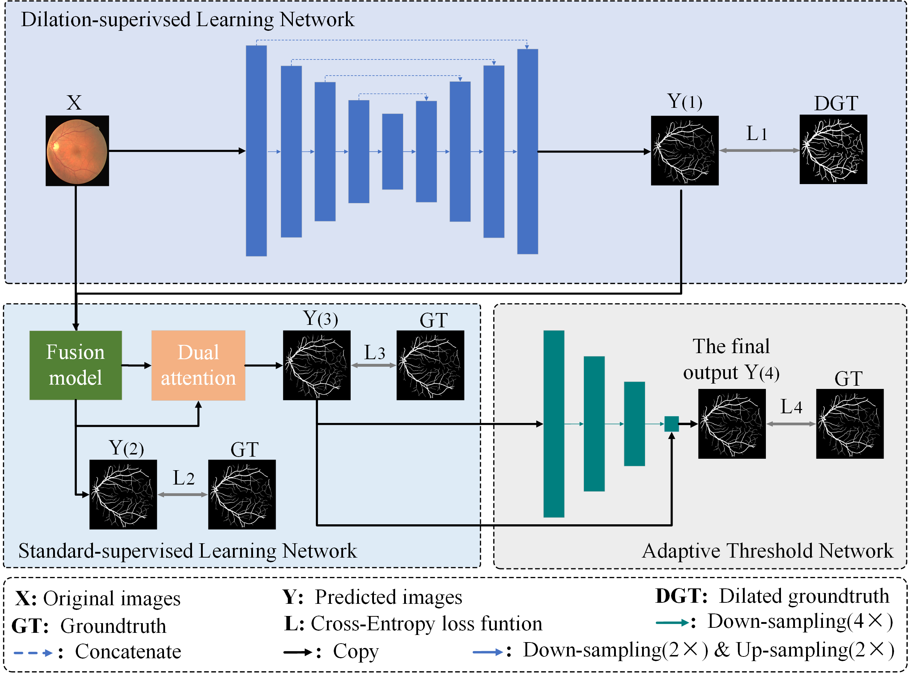
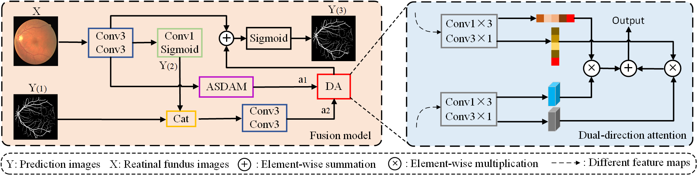
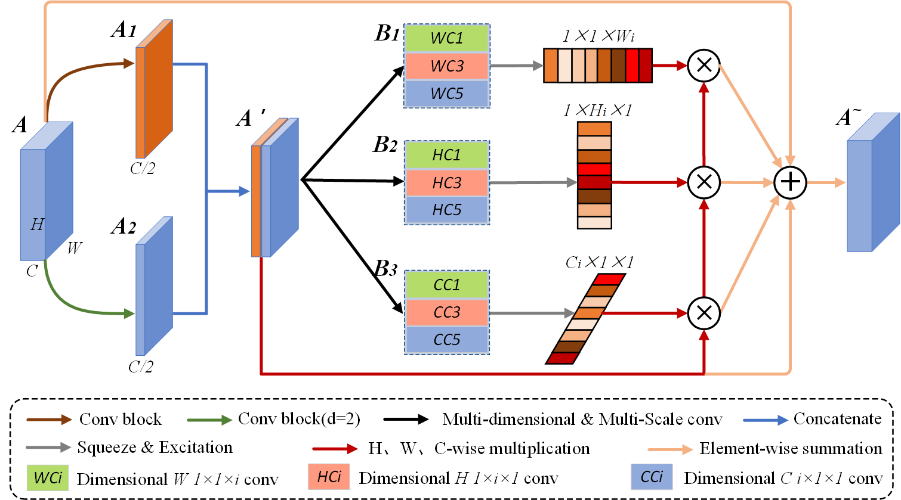

# Dilation-supervised

This repository is the PyTorch code for the paper 'Dilation-supervised Learning: A Novel Strategy for
Scale Difference in Retinal Vessel Segmentation'
[[Paper]](10.1109/TAI.2023.3296687)

## Introduction
<div align="center">
  
</div>
<div align="center">
  
</div>
<div align="center">
  
</div>

Retinal fundus image segmentation based on deep learning is an important method for auxiliary diagnosis of ophthalmic diseases. Due to the scale difference of the blood vessels and the imbalance between foreground and background pixels
in the fundus image, the deep learning network will inevitably ignore thin vessels when down-sampling and feature learning.
For the scale difference problem, this paper aims to tackle its limitation from two perspectives: changing the supervised
approach and adapting the feature learning. Correspondingly, a dilation-supervised learning method and an adaptive scale
dimensional attention mechanism which are used to construct a two-stage segmentation model is proposed. Moreover, we
introduce a quantitative approach to evaluate the scale difference of the blood vessels. With the help of the proposed weighted
loss function, the segmentation results are refined, and the class imbalance problem between foreground and background pixels
is resolved. Finally, the proposed adaptive threshold selection method is used in the post-processing of segmentation results. The
experiments on DRIVE, STARE, CHASE DB1, and HRF datasets show that the proposed method achieves better segmentation
performance compared with other state-of-the-art methods, and has good generalization ability and robustness. 


## Training on DRIVE, CHASE_DB1, SATRE, and HRF

### Stage 1: Downloading Datasets

```
Please download the retina image datasets(DRIVE, STARE, CHASE_DB1, and HRF) to dilation_supervised/dataset1
```
### Stage 2: data enhancement

```
cd root/dilation_supervised/data_process
python read_dateset_crop.py
```
### Stage 3: train

```
cd root/dilation_supervised/train_test
python train_vessel.py
```


## Testing on DRIVE, CHASE_DB1, SATRE, and HRF
```
cd root/dilation_supervised/train_test
python eval_test.py
```


## Citation
If you think this repo and the manuscript helpful, please consider citing us.
```
@inproceedings{
  title={Dilation-supervised Learning: A Novel Strategy for Scale Difference in Retinal Vessel Segmentation},
  author={Wang Huadeng, Zuo Wenbin, Lan Rushi},
  booktitle={IEEE Transactions on Artificial Intelligence},
  year={2023},
}
```


